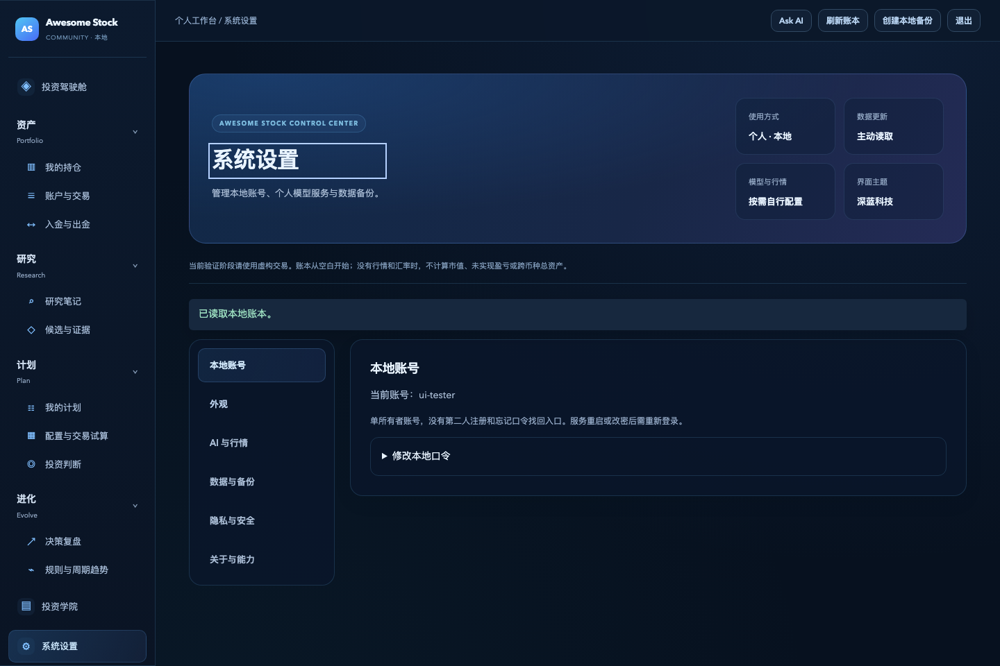

# Awesome Stock · Community

A self-hosted personal investing workspace connecting your ledger, research, decisions, plans and reviews. Run it on your own computer, with your own data and optional model services.

**Pre-release candidate. Not publicly released.** The project license is AGPL-3.0-only; the final version, third-party rights review and publication approval remain pending. Screenshots use synthetic test data only.

[中文](README.md) · [Installation and recovery](OWNER_INSTALL.md) · [Security](SECURITY.md)

## Run locally

The first release supports native source installation on macOS Apple Silicon (arm64), with Python 3.10+. The application uses only the standard library; no Node runtime, database service or AI model is required.

```sh
python3 start_owner.py --open-browser
```

Visit `http://127.0.0.1:4322/ledger` and create your own local account. There are no default credentials or preloaded holdings.

Docker installation and prebuilt container images are deferred. Windows, Linux and Intel Macs are outside the supported first-release scope. See [installation and recovery](OWNER_INSTALL.md).

## Workspaces

- **Cockpit:** ledger facts, gaps, action feedback and recent trades.
- **Portfolio:** separate accounts and currencies, long-only trades, cash flows, per-account FIFO or weighted-average accounting, CSV preview/import and manual price snapshots.
- **Research:** candidates, evidence, explicit filters, comparisons and versioned notes.
- **Plan:** versioned decisions, supporting/counter evidence, invalidation conditions, manual plans and read-only allocation/trade scenarios.
- **Evolve:** reviews tied to historical evidence, manual rules and process trends.
- **Academy:** educational articles from the original application with diagrams, search and categories.

Settings include account and data controls, optional connections, import/export, light/dark/system appearance, desktop sidebar width, and a cockpit privacy toggle. Appearance and cockpit privacy preferences are saved only in the current browser.



## Your services, your costs

OpenAI, DeepSeek, user-installed Ollama, Alpha Vantage and EODHD are optional, disabled by default and called only after explicit actions. The default market-data candidate uses Yahoo public daily data without a key, with source terms still pending release review; it never queries on startup or automatically switches to a user API. Each user supplies their own access and pays their provider for configured services. No shared project key or subsidy is provided. Cloud model IDs are supplied by each user. Alpha Vantage provides optional US/USD and Shanghai-Shenzhen A-share/CNY daily prices and history; the independent EODHD connection provides Hong Kong/HKD daily data. Company and news connections currently cover US securities only. See [provider boundaries](docs/OPTIONAL_PROVIDERS.md).

Keys stay in server process memory and clear on logout, password change or restart. Ask Awesome supports free questions and follow-ups; each message, attached material and session history is reviewed before sending. Conversation history stays in page memory and clears on refresh; responses cannot execute trades. No broker synchronization, real-time pricing or automatic migration from the private product is provided.

## Data and status

Local SQLite data lives in `.owner-state` unless `--data-dir` is set. Backups are unencrypted and include credential hashes and business history. Recovery creates a new directory without replacing the original. Cross-currency summaries use recorded, valid user-supplied FX rates to convert to USD; unavailable prices or FX rates remain explicitly missing. Converted P&L excludes historical FX gains and losses.

See [validation](docs/VALIDATION.md), [development checks](docs/DEVELOPMENT.md) and [contribution policy](CONTRIBUTING.md).

## License and release

Copyright (c) 2026 Evan. Project-owned code is licensed under **AGPL-3.0-only**; see [LICENSE](LICENSE) and [licensing scope](LICENSING.md). No separate commercial license is offered for this release; commercial use complying with AGPL remains permitted. Third-party inputs retain their own licenses. Outstanding notice/provenance reviews, market-data terms and publication approval remain separate conditions. No prebuilt image, model weights or private repository history is distributed.
