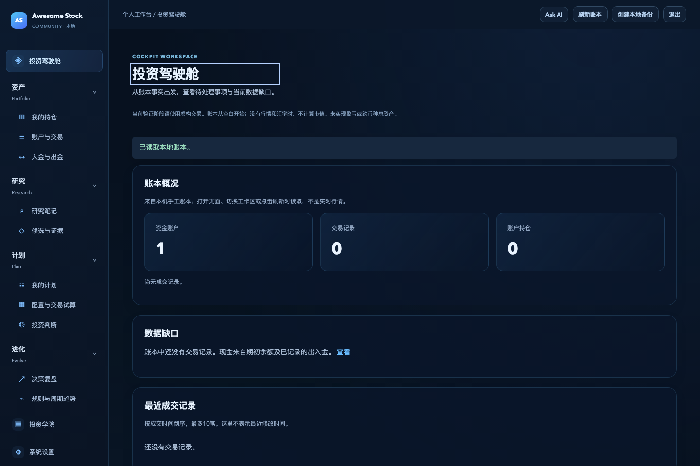
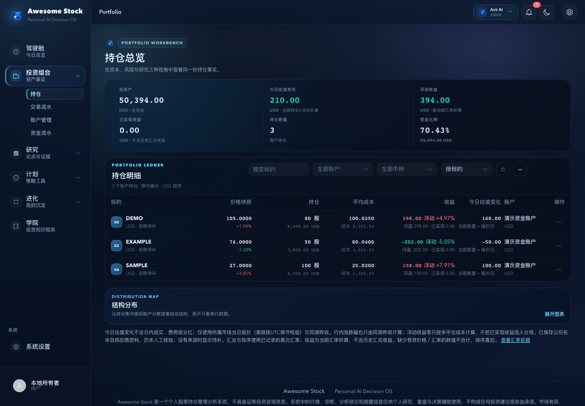
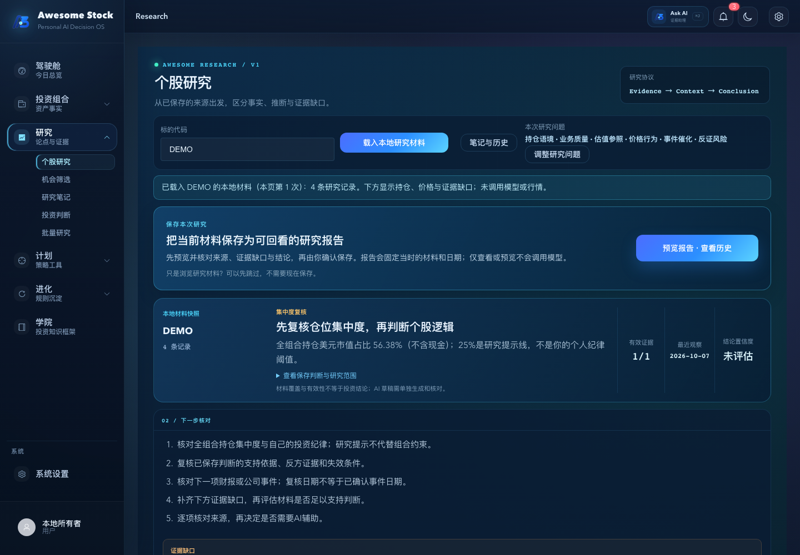
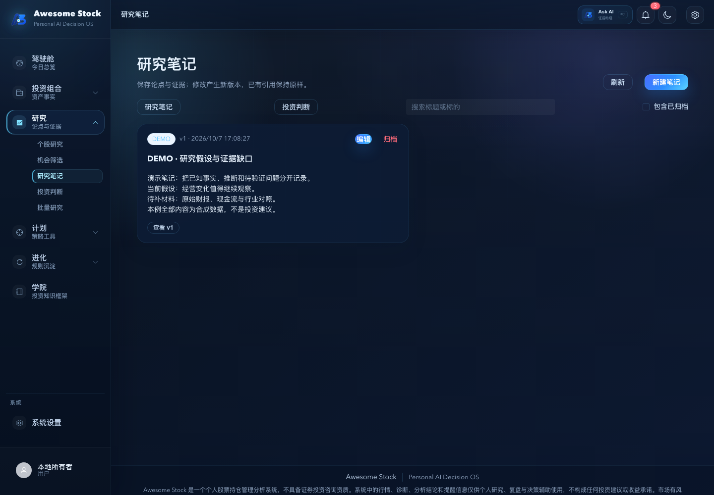
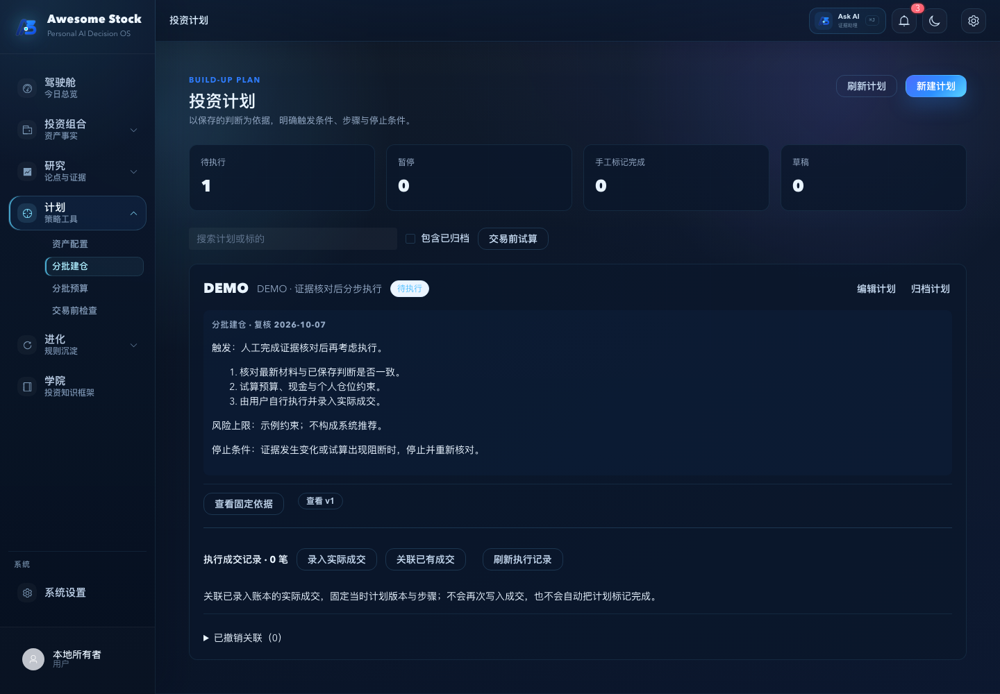
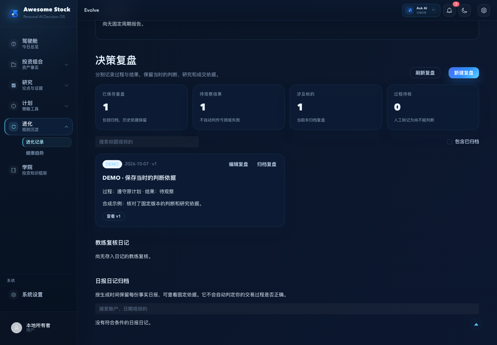
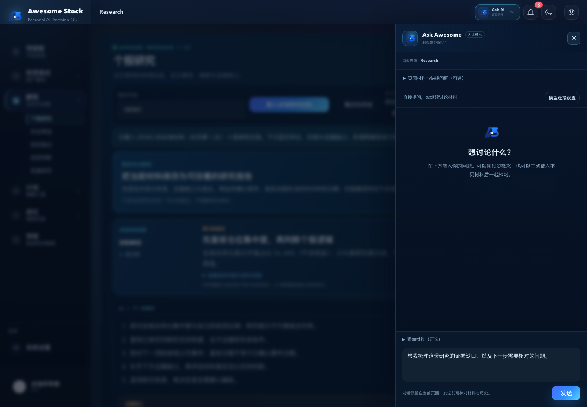
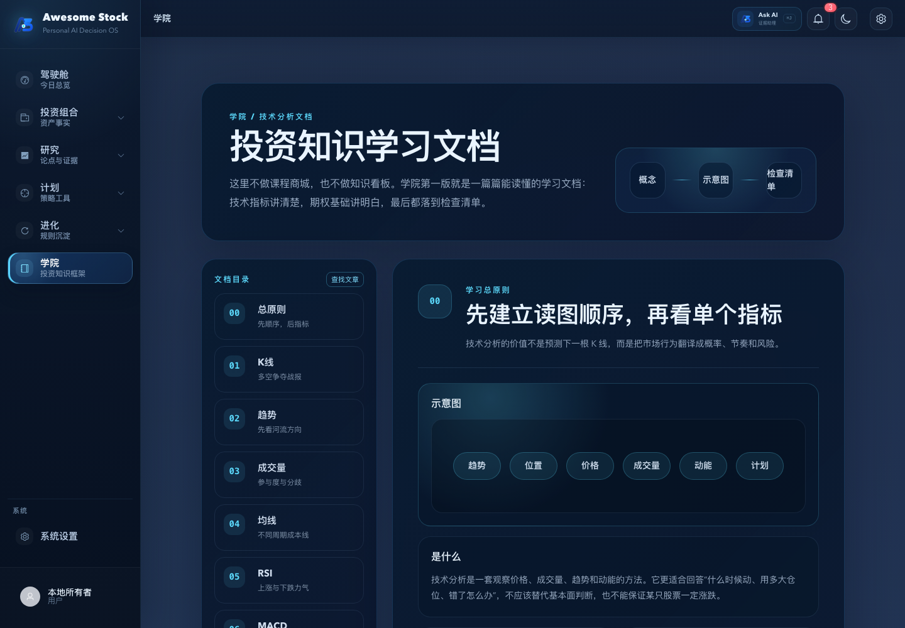
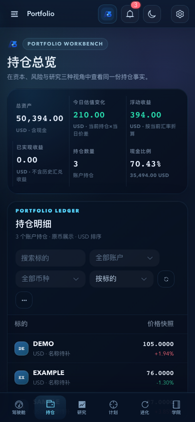
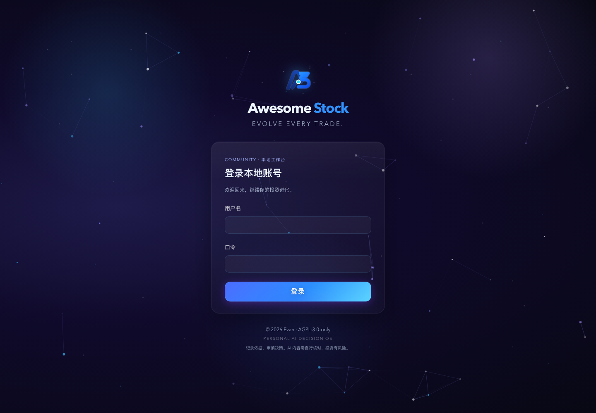

# Awesome Stock Community

**AI 原生个人投资进化系统。**

**Powered by Atom Awareness** 
Independent AI Product & Research Studio.

**Evolve Every Trade.**

已发布 · Community v1.0.1 · 本地运行 · macOS Apple Silicon

把资产、研究、判断、计划与复盘连接起来，让每一次投资留下可回看的依据，逐步形成更适合自己的投资方法。

需要时，在 Ask Awesome 中自由提问、追问，或主动附加自己的材料。发送内容与模型调用由你确认，AI 回复作为可核对的草稿；判断与行动由你掌握。基础业务无需模型或行情 API。

[下载 Community v1.0.1](https://github.com/JayeeeJY/awesome-stock/releases/tag/v1.0.1) · [第一次使用](https://github.com/JayeeeJY/awesome-stock/blob/v1.0.1/docs/QUICKSTART.md) · [模型与行情配置](https://github.com/JayeeeJY/awesome-stock/blob/v1.0.1/docs/OPTIONAL_PROVIDERS.md)

支持 macOS Apple Silicon，Python 3.10+。项目自有代码采用 AGPL-3.0-only。

*以下界面截取于 2026-10-07，来自正式发布的 Community v1.0.1。账号、标的、交易、价格、研究和计划均为合成示例，用于展示使用流程，不代表真实投资组合或收益。*

## 把分散的投资记录，连接成可以回看的过程

你可能在一个地方看持仓，在另一个地方写研究，靠记忆保存买卖理由，事后却难以还原当时为什么做出决定。

Awesome Stock 帮你留下这条线：

**资产事实 → 研究证据 → 投资判断 → 执行计划 → 实际成交 → 决策复盘**

- **看清自己的钱在哪里。** 账户、现金、持仓和成交有清楚的记录；缺少价格或汇率时，明确告诉你还缺什么。
- **把判断的依据保存下来。** 支持证据、反方观点和失效条件与历史版本一起保留，方便以后回看。
- **在行动前核对计划。** 先检查预算、现金和自己的风险约束，再自行决定是否执行。
- **在事后复盘过程。** 回看当时的依据，区分是否遵守计划与结果如何，积累值得保留的经验。

## 在 Community 里，走完一次投资工作流程

### 1. 先了解资产，而不是从一条孤立的信息开始

驾驶舱和持仓工作区把资金账户、持仓、估值与待核对事项放在一起。多账户、多币种保留各自的事实；手工价格带日期和来源，方便核账。

### 2. 把观点变成可以核对的研究

从保存的本地材料开始研究，记录事实与推断、支持与反方证据。研究笔记可以修订，已有版本引用保留当时的内容；判断不只是一句“看好”，还包括哪些证据可能让你改变主意。

查看研究笔记与版本界面

### 3. 在实际行动前，把计划写清楚

记录计划依据、触发条件、分步执行方式与停止条件。用资产配置、分批预算和交易前试算核对假设；自行执行之后，再把实际成交关联到计划。

### 4. 复盘当时的决定，积累自己的经验

用投资日记记录观察，在决策复盘中回看当时的研究与判断。记录过程是否遵守计划、结果是否已经出现，以及下一步需要核对什么。Community 的规则由用户手工维护。

### 5. 需要时，让 AI 协助你理解材料

从一个问题开始，也可以把当前页面的材料带入对话。用 Ask Awesome 梳理概念、核对依据，或找出还需要补充的证据。

AI 回复供你阅读、核对和整理；模型连接、发送内容与费用说明见下文。

查看学院与手机宽度界面

*手机宽度截图展示浏览器界面的响应式布局；首发安装支持仍为 macOS Apple Silicon，不代表独立手机应用已经发布。*

## AI 围绕你的材料协作，判断与行动由你掌握

AI 原生在 Community 中的具体体验，是让模型帮助理解和核对材料，同时保留你的控制权：

- **直接提问，也可以继续追问。** Ask Awesome 有自由输入对话框，可以讨论投资概念，也可以围绕已有材料展开交流。
- **上下文由你选择。** 主动附加当前页面材料，发送前核对问题、材料与对话历史；打开助手不会自动调用模型。
- **服务由你配置，结论由你核对。** 使用自己的 DeepSeek、OpenAI API Key 或本地 Ollama。模型回复是辅助草稿，不自动成为已确认的判断、计划或交易。

模型是可选连接，账本、研究、计划与复盘可以独立使用。数据默认保存在本机；只有你确认发送的内容会交给所配置的模型服务。

## 不配 API，也可以先用起来

先创建本地账号与资金账户，记录期初现金、成交和研究，再保存带来源的手工价格。CSV 用于成交导入，导入前有预览；不是行情历史导入。

如果需要 AI 或自动行情查询，再配置自己的服务：

- **模型：** DeepSeek、OpenAI 或自行安装的 Ollama；云端费用由你的供应商账号承担。
- **日级行情：** 自有 Alpha Vantage（美股/A股）或 EODHD（港股）账号与权限；查询后核对，再明确保存。首发没有 Yahoo 免 Key 行情，不提供统一 Key 或代付。
- **数据：** 默认保存在本机，可指定独立目录并创建备份。Key 只留在服务进程内存，不进入备份或导出；完整备份未加密，需要妥善保管。

下载 [Release 中的命名源码包](https://github.com/JayeeeJY/awesome-stock/releases/tag/v1.0.1)，解压进入 `awesome-stock-owner`，按[安装指南](https://github.com/JayeeeJY/awesome-stock/blob/v1.0.1/OWNER_INSTALL.md)运行。包自带编译界面，无需 Node、数据库服务或模型即可启动。

没有默认账号密码。Windows、Linux、Intel Mac、Docker 和独立移动客户端暂不在首发正式支持范围。Community v1.0.1 不支持券商同步、自动下单、空头或期权记账。

## 一起让投资经验变得更有价值

如果你愿意自己管理投资记录、认真保留判断依据，并从每次决策中积累经验，欢迎试用 Community。

[下载稳定版](https://github.com/JayeeeJY/awesome-stock/releases/tag/v1.0.1) · [阅读使用指南](https://github.com/JayeeeJY/awesome-stock/blob/v1.0.1/docs/QUICKSTART.md) · [提出问题与产品反馈](https://github.com/JayeeeJY/awesome-stock/issues) · [关注版本进展](https://github.com/JayeeeJY/awesome-stock/releases)

### 由真实使用驱动，持续迭代

Awesome Stock 是 Atom Awareness 工作室的个人投资产品，由 Evan 创建并维护。我会基于自己的日常使用，持续打磨 Community 的功能与体验，也欢迎你分享使用中的问题、想法与建议。

欢迎通过以下渠道与我交流：

| 渠道 | 联系方式 |
| --- | --- |
| WhatsApp 用户名 | `Jiayong987` |
| 微信号 | `ChuanL007` |
| 邮箱 | [316600025@qq.com](mailto:316600025@qq.com) |

首发接收 Issue 与产品反馈，暂不接收外部代码贡献。请勿公开 API Key、真实持仓、交易明细或备份；安全问题请使用 [GitHub 私密漏洞报告](https://github.com/JayeeeJY/awesome-stock/security/advisories/new)。

Copyright (c) 2026 Evan。项目自有代码采用 [AGPL-3.0-only](https://github.com/JayeeeJY/awesome-stock/blob/v1.0.1/LICENSE)，第三方保留原许可；本次不提供独立商业许可。安装、隐私、安全与验证细节见仓库文档。

## 登录界面

首次使用创建自己的本地账号；已有账号直接登录。深蓝星空与粒子连线构成登录页背景，系统开启「减少动效」时保留静态星光。

[English](README.en.md)

---

Awesome Stock Community / Powered by Atom Awareness 
Independent AI Product & Research Studio · Make complexity perceivable.
